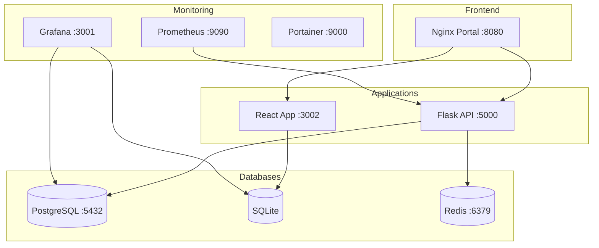

# 🌐 My Portal

> Единая платформа для управления, мониторинга и аналитики региональных проектов.  
> Полностью контейнеризированное решение на базе Docker.

---

## 📋 Содержание

- [Обзор](#-обзор)
- [Архитектура](#-архитектура)
- [Стек технологий](#-стек-технологий)
- [Быстрый старт](#-быстрый-старт)
- [Сервисы](#-сервисы)
- [Аналитика (Grafana)](#-аналитика-grafana)
- [API](#-api)
- [Структура проекта](#-структура-проекта)
- [Конфигурация](#-конфигурация)
- [Разработка](#-разработка)

---

## 🔍 Обзор

Портал объединяет два основных проекта:

| Проект | Назначение | База данных |
|--------|-----------|-------------|
| **Топливообеспечение** | Мониторинг поставок, запасов и реализации ГСМ | PostgreSQL |
| **Материальные резервы** | Учёт и распределение материальных ресурсов по районам | SQLite |

Все сервисы запускаются одной командой через Docker Compose, включая мониторинг, визуализацию данных и управление контейнерами.

---

## 🏗 Архитектура



### Сетевая структура

| Сеть | Сервисы | Назначение |
|------|---------|-----------|
| `portal-network` | Portal, Flask, React, Grafana, Prometheus, Portainer | Фронтенд + проксирование |
| `backend-network` | Flask, PostgreSQL, Redis, Grafana | Данные + кэширование |
| `monitoring-network` | Prometheus, Grafana | Метрики |

---

## 🛠 Стек технологий

| Компонент | Технология |
|-----------|-----------|
| Веб-сервер / Прокси | Nginx |
| Backend API (ГСМ) | Python, Flask, SQLAlchemy, Gunicorn |
| Frontend + API (Мат. резервы) | Node.js, Express, Vite, SQLite3 |
| Реляционная БД | PostgreSQL 15 |
| Кэш / Очереди | Redis 7 |
| Мониторинг метрик | Prometheus |
| Визуализация / Дашборды | Grafana |
| Управление контейнерами | Portainer CE |
| Контейнеризация | Docker, Docker Compose |

---

## 🚀 Быстрый старт

### Предварительные требования

- [Docker](https://docs.docker.com/get-docker/) >= 20.10
- [Docker Compose](https://docs.docker.com/compose/install/) >= 2.0

### Установка

1. **Клонировать репозиторий:**
   ```bash
   git clone <URL-репозитория>
   cd my_portal
   ```

2. **Настроить переменные окружения:**
   ```bash
   cp .env.example .env
   # Отредактировать .env — задать пароли и секретные ключи
   ```

3. **Запустить все сервисы:**
   ```bash
   docker-compose up -d
   ```

4. **Проверить статус:**
   ```bash
   docker-compose ps
   ```

### Доступ к сервисам

После запуска все сервисы доступны по IP вашей машины (динамически определяется):

| Сервис | Порт | Описание |
|--------|------|----------|
| Портал | `:8080` | Главная страница + навигация |
| Flask API | `:5000` | REST API топливообеспечения |
| React App | `:3002` | Карта + мат. резервы |
| Grafana | `:3001` | Аналитические дашборды |
| Prometheus | `:9090` | Мониторинг метрик |
| Portainer | `:9000` | Управление Docker |

---

## 📊 Аналитика (Grafana)

Grafana настроена через **provisioning** — источники данных и дашборды создаются автоматически при старте.

### Источники данных

| Источник | Тип | Назначение |
|----------|-----|-----------|
| PostgreSQL | `postgres` | Данные топливообеспечения |
| SQLite | `frser-sqlite-datasource` | Данные мат. резервов |

### Дашборд «Топливообеспечение — Обзор»

13 панелей с аналитикой ГСМ:

| Панель | Тип визуализации |
|--------|-----------------|
| Количество компаний | Stat |
| Загруженные файлы | Stat |
| Работающие АЗС | Stat |
| Средний запас по видам топлива (АИ-92, АИ-95, Дизель) | Gauge |
| Запасы по компаниям | Bar chart |
| Реализация vs Потребность | Bar chart |
| Потребность по месяцам | Time series |
| Загрузки файлов по дням | Time series |
| Структура компаний (АЗС / нефтебазы) | Table |
| Поставки по компаниям | Table |
| Авиатопливо — баланс по аэропортам | Table |

### Дашборд «Материальные резервы — Аналитика»

15 панелей с аналитикой распределения ресурсов:

| Панель | Тип визуализации |
|--------|-----------------|
| Количество районов / категорий / позиций / распределений | Stat |
| Общая стоимость / Общее количество | Stat |
| Стоимость по категориям | Pie chart (donut) |
| Количество по категориям | Pie chart (donut) |
| Распределение по годам | Bar chart |
| Топ-15 районов по стоимости | Bar chart |
| Топ-15 районов по количеству позиций | Bar chart |
| Средняя стоимость позиции по категориям | Bar chart |
| Среднее количество на район по годам | Bar chart |
| Население районов | Bar chart |
| Полная таблица распределения | Table |

---

## 🔌 API

### Flask API — Топливообеспечение

| Метод | Endpoint | Описание |
|-------|----------|----------|
| `GET` | `/health` | Проверка состояния сервиса |
| `GET` | `/api/companies` | Список компаний |
| `POST` | `/api/upload` | Загрузка Excel-отчёта |
| `GET` | `/api/reports` | Список загруженных файлов |
| `GET` | `/api/consolidated` | Сводные данные |

### Express API — Материальные резервы

| Метод | Endpoint | Описание |
|-------|----------|----------|
| `GET` | `/api/districts` | Все районы |
| `GET` | `/api/district/:id` | Информация о районе |
| `GET` | `/api/district/:id/data` | Материальные резервы района |
| `GET` | `/api/indicators` | Справочник показателей |
| `POST` | `/api/upload-excel` | Импорт данных из Excel |
| `GET` | `/api/export-excel` | Экспорт данных в Excel |
| `GET` | `/api/check-export` | Проверка наличия данных |

---

## 📁 Структура проекта

```
my_portal/
├── landing/                     # Nginx портал (главная + админ-панель)
│   ├── Dockerfile
│   ├── nginx.conf
│   ├── index.html               # Главная страница
│   ├── admin.html               # Панель администратора
│   └── login.html               # Страница авторизации
│
├── flask-app/                   # Flask API (топливообеспечение)
│   ├── Dockerfile
│   ├── run.py                   # Точка входа
│   ├── database/
│   │   └── models.py            # SQLAlchemy модели (10+ таблиц)
│   └── requirements.txt
│
├── react-app/                   # React + Express (мат. резервы)
│   ├── Dockerfile
│   ├── src/
│   │   ├── server.cjs           # Express API сервер
│   │   ├── App.jsx              # React компонент
│   │   └── ...
│   ├── schema.sql               # Схема SQLite
│   ├── init_db.cjs              # Инициализация БД
│   └── vite.config.js
│
├── monitoring/                  # Конфигурация мониторинга
│   ├── prometheus.yml
│   ├── grafana-provisioning/
│   │   ├── datasources/         # Авто-подключение PostgreSQL + SQLite
│   │   └── dashboards/          # Провайдер дашбордов
│   └── grafana-dashboards/
│       ├── fuel_overview.json   # Дашборд топливообеспечения
│       └── reserves_overview.json # Дашборд мат. резервов
│
├── docker-compose.yml           # Основная конфигурация (8 сервисов)
├── docker-compose.override.yml  # Переопределения для разработки
├── init-db.sql                  # Инициализация PostgreSQL
├── config.js                    # Глобальная конфигурация
├── .env                         # Переменные окружения 
└── README.md
```

---

## ⚙️ Конфигурация

### Переменные окружения (`.env`)

> ⚠️ **Не коммитьте `.env` в репозиторий.** Используйте `.env.example` как шаблон.

| Переменная | Описание |
|-----------|----------|
| `ADMIN_USER` | Логин администратора |
| `ADMIN_PASSWORD` | Пароль администратора |
| `JWT_SECRET` | Секрет для JWT-токенов |
| `FLASK_SECRET_KEY` | Секретный ключ Flask |
| `DB_USER` | Пользователь PostgreSQL |
| `DB_PASSWORD` | Пароль PostgreSQL |
| `REDIS_PASSWORD` | Пароль Redis |
| `GRAFANA_PASSWORD` | Пароль админа Grafana |

### Динамический hostname

Все ссылки в интерфейсе используют `window.location.hostname` — портал автоматически работает с любого IP-адреса (localhost, LAN IP и т.д.) без изменения конфигурации.

---

## 🧑‍💻 Разработка

### Режим разработки

Файл `docker-compose.override.yml` автоматически применяется при запуске и включает:
- **Hot reload** для Flask (через Flask debug mode)
- **Монтирование исходников** для live-редактирования
- Переопределение команд запуска

```bash
# Запуск в dev-режиме (override применяется автоматически)
docker-compose up -d

# Просмотр логов конкретного сервиса
docker-compose logs -f flask-app

# Пересборка после изменения Dockerfile
docker-compose up -d --build flask-app
```

### Полезные команды

```bash
# Остановить все сервисы
docker-compose down

# Остановить и удалить данные
docker-compose down -v

# Пересобрать все образы
docker-compose build --no-cache

# Инициализировать БД мат. резервов
docker-compose exec react-app node init_db.cjs
```

---

## 📜 Лицензия

Проект разработан для внутреннего использования. Все права защищены.
